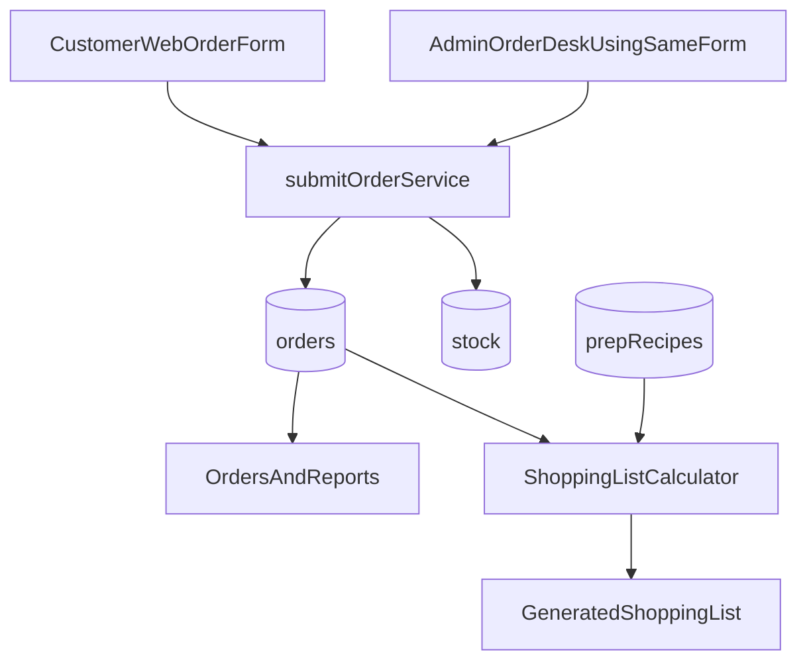

# Evolve to In-House Order Desk

## Direction

- Keep one order pipeline and one core order-entry form (`OrderForm`) for both channels.
- Treat **customer web orders** and **admin-entered orders** as different sources, not different systems.
- Add admin-only capabilities: customer history/quick-fill, shopping-list calculation, and better order readability.

## Why no separate admin form

- Existing form already captures all required fields (customer, location, payment, notes).
- Reusing one form prevents validation drift and duplicate bugs.
- Admin speed can come from wrappers (quick-fill/source/presets), not a second implementation.

## Planned Implementation

### 1) Add source + customer-history data model (non-breaking)

- Extend order model in [src/types/firestore.ts](src/types/firestore.ts):
  - `orderSource?: "web" | "line" | "phone" | "walk_in" | "admin_manual"`
  - `customerId?: string` (optional)
- Add customer profile model (new collection `customers`) with fields:
  - name, phone, default address, last order timestamps, notes (optional)
- Ensure existing orders remain valid (all new fields optional).

### 2) Reuse existing OrderForm in admin mode

- Reuse [src/features/ordering/OrderForm.tsx](src/features/ordering/OrderForm.tsx) with a mode prop (e.g., `mode: "customer" | "admin"`).
- In admin mode:
  - show `Order source` selector
  - show customer quick-fill dropdown/search from recent `customers`
  - keep same core required order fields and submit path
- Keep submission through [src/features/ordering/orderService.ts](src/features/ordering/orderService.ts) so stock/lifecycle remain unified.

### 3) Add recipe/ingredient configuration (editable, dummy-safe)

- Add admin-configurable recipe entities (new collection `prepRecipes`) with:
  - `target` (e.g., `sauce`, `salad`)
  - `calcMode`: `per_item` or `per_batch`
  - `servingsPerBatch` (for batch mode)
  - ingredients list: name, unit, amount, wastePct(optional)
- Seed with editable dummy defaults so business can tune later without code changes.

### 4) Shopping list generator from orders

- Build calculator service in `features/admin`:
  - read active orders by selected period/filter
  - compute target servings (sauce/salad/etc.) from order items
  - translate servings into ingredient totals via configured recipe mode
- Output grouped shopping list:
  - ingredient, total quantity, unit, source target(s), assumption notes
- Add UI section under Orders + Reports for “Generate shopping list”.

### 5) Improve order card clarity (requested UI fixes)

- In [src/features/admin/OrdersPanel.tsx](src/features/admin/OrdersPanel.tsx):
  - add explicit labels (Order ref, Customer, Total, Status, Address, Created at)
  - add visible chevron indicator for collapsed/expanded state on each order row
  - preserve compact list behavior already introduced

### 6) Keep routes/channels separated but compatible

- Public route stays customer-safe.
- Admin stays secured and gets the enhanced tools.
- Both create orders in the same collection/service with different `orderSource` values.

## Data Flow (target)

## Rollout order

1. Data model extensions (optional fields only)
2. Admin mode for shared form + source + quick-fill
3. Recipe configuration UI + dummy seed data
4. Shopping list calculator + results UI
5. Orders panel label/chevron polish

## Risks and mitigations

- Incorrect ingredient math due to recipe setup errors: show assumption metadata and preview totals before final use.
- Schema transition risk: keep new fields optional and provide fallback handling for old orders.
- UX complexity: place admin-only controls behind mode flag; preserve existing customer flow unchanged.
